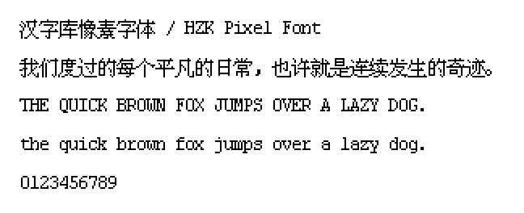

**注意：**

本字体字模版权并非公有领域，无法提供字体许可证。

如果您正在寻找可以免费商用的开源中文像素字体，请尝试以下项目：

- [方舟像素字体](https://github.com/TakWolf/ark-pixel-font)
- [缝合像素字体](https://github.com/TakWolf/fusion-pixel-font)

# 汉字库像素字体 / HZK Pixel Font

中文像素字体，支持 12 和 16 像素。字符范围仅覆盖 ASCII 和 GB2312。

这个项目提供了构建字体所需要的完整程序。

## 预览

[在线预览](https://hzk-pixel-font.takwolf.com)

12 像素预览：

16 像素预览：

## 下载

可在 [Releases](https://github.com/TakWolf/hzk-pixel-font/releases) 下载最新的版本。

## 授权信息

### 字体

本字体使用的字模来源于：https://github.com/aguegu/BitmapFont/tree/master/font

根据 [原项目作者博客描述](https://web.archive.org/web/20161108093925/http://aguegu.net/?p=1279) ，该字模可能来源于 UCDOS ，或是早期的 WPS 。

经过我个人比对，这个字模应该出自早期的 Windows 系统字体。您可以通过 [这篇文章提供的截图](https://zhuanlan.zhihu.com/p/37334387) 自行比对。

中文的部分应该是由「北京中易中标电子信息技术有限公司」设计开发，字模版权并非公有领域。

因此，本字体无法提供许可证。您在使用时，请务必谨慎考量并自负版权风险。

### 构建程序

使用 [MIT 许可证](LICENSE) 授权。

## 程序依赖

- [Pixel Font Builder](https://github.com/TakWolf/pixel-font-builder)
- [Character Encoding Utils](https://github.com/TakWolf/character-encoding-utils)
- [PyPNG](https://gitlab.com/drj11/pypng)
- [Pillow](https://github.com/python-pillow/Pillow)
- [GitPython](https://github.com/gitpython-developers/GitPython)
